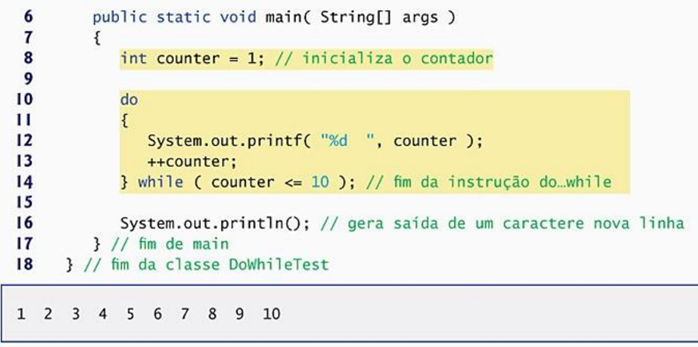
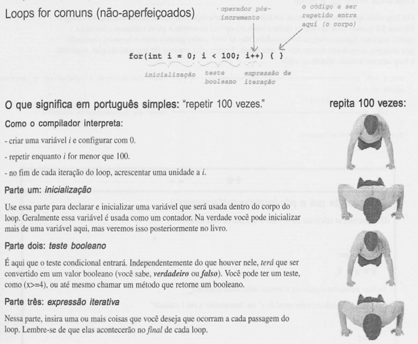
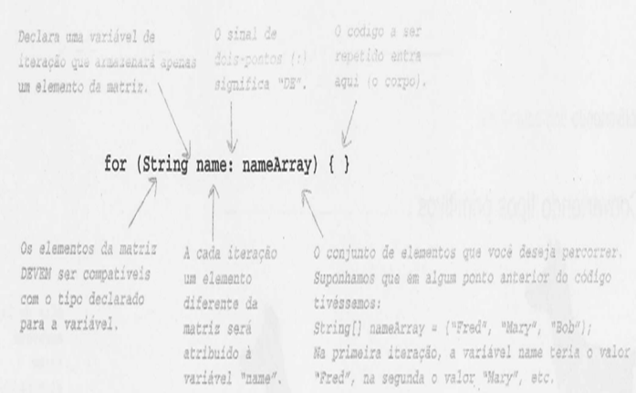

# Introdução a programação orientada à objetos

## Describe project
Exercícios, exemplos e resumos sobre Java e orientação à objetos.

## Pre Requirements
- Java 8 ou superior: 

## Summary
- [Primeiros programas](https://github.com/brunocampos01/intro-a-programacao-orientada-a-objetos/tree/master/primeiros_programas)
- [Algoritmos matemáticos](https://github.com/brunocampos01/intro-a-programacao-orientada-a-objetos/tree/master/algoritmos_matematicos)
- [Estruturas de seleção](https://github.com/brunocampos01/intro-a-programacao-orientada-a-objetos/tree/master/estruturas_de_selecao)
- [Estruturas de repetição](https://github.com/brunocampos01/intro-a-programacao-orientada-a-objetos/tree/master/estruturas_de_repeticao)

## Instruções de Controle
- Estrutura de sequência (o processador lê linha por linha)
- Estrutura de seleção
- Estrutura de repetição

### Estrutura de repetição
Em JAVA há 3: 
- While 
- Do...while 
- For 

#### While 
- Uma instrução de repetição (ou um loop) permite especificar que um programa deve repetir uma ação enquanto alguma condição permanece verdadeira.  
- O loop só é executado se a condição for TRUE. 

#### Do...while 
- A instrução de repetição do while é semelhante à instrução while. 
- Aqui o loop é executado 1 vez SEMPRE!!! 
- A instrução do while testa a condição de continuação do loop depois de executar o corpo do loop. 

Em UML:

#### For

#### For each

O que isso significa em português claro: "a cada elemento de nameArray, atribua o elemento a variável 'name' e execute o corpo do loop." 

Como o compilador interpretaria: 
- Criar uma variável de string chamada name e configura-la com nulo. 
- Atribuir o primeiro valor de nameArray a variável name. 
- Executar o corpo do loop (o bloco de código dentro das chaves). 
- Atribuir o próximo valor de nameArray a name. 
- Repetir enquanto ainda houver elementos na matriz
- Exemplo

#### Diferenças entre FOR e WHILE
Ele será útil quando você não souber quantas vezes o loop será executado e quiser continuar a executado apenas enquanto alguma condição for verdadeira.  
Mas se você souber quantas vezes o loop será executado (por exemplo, dependendo do tamanho de uma matriz, 7 vezes, etc.), um loop for será mais simples. Aqui está o loop anterior reescrito usando-se while. 

## References 
- Java: como programar, autor Paul Deitel

## Author
- Bruno Aurélio Rôzza de Moura Campos (brunocampos01@gmail.com)
## Copyright
 This work by Bruno A. R. M. Campos is licensed under a <a rel="license" href="http://creativecommons.org/licenses/by-sa/4.0/">Creative Commons Attribution-ShareAlike 4.0 International License</a>.
