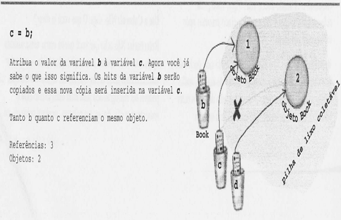
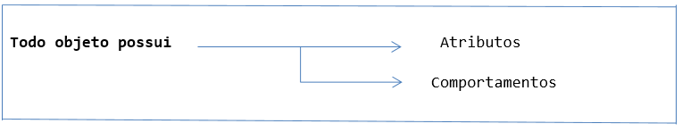

# Introdução a Programação Orientada à Objetos

Exercícios, exemplos e resumos sobre fundametos de programação orientada à objetos.

## Requirements
| Requisite      | Version  |
|----------------|----------|
| Java           | 1.8.0_282|
| Javac          | 1.8.0_282|

## Sumário
### Exercícios em Java
- [Primeiros programas](primeiros-programas)
- [Algoritmos matemáticos](algoritmos-matematicos)
- [Estruturas de seleção](estruturas-de-selecao)
- [Estruturas de repetição](estruturas-de-repeticao)

### Instruções de Controle
- Estrutura de sequência (o processador lê linha por linha)
- Estrutura de seleção
- Estrutura de repetição

### Conceitos Básicos
- Objeto
- Classe
- Métodos Get e Set
- Método Construtor  
- self/this

---

### Estrutura de repetição
- While 
- Do...while 
- For 

#### While 
- Uma instrução de repetição (ou um loop) permite especificar que um programa deve repetir uma ação enquanto alguma condição permanece verdadeira.  
- O loop só é executado se a condição for TRUE. 

#### Do...while 
- A instrução de repetição do while é semelhante à instrução while. 
- Aqui o loop é executado 1 vez SEMPRE!!! 

- A instrução do while testa a condição de continuação do loop depois de executar o corpo do loop. 

Em UML:

#### For

#### For each

O que isso significa em português claro: "a cada elemento de nameArray, atribua o elemento a variável 'name' e execute o corpo do loop." 

Como o compilador interpretaria: 
- Criar uma variável de string chamada name e configura-la com nulo. 
- Atribuir o primeiro valor de nameArray a variável name. 
- Executar o corpo do loop (o bloco de código dentro das chaves). 
- Atribuir o próximo valor de nameArray a name. 
- Repetir enquanto ainda houver elementos na matriz
- Exemplo

#### Diferenças entre FOR e WHILE
Ele será útil quando você não souber quantas vezes o loop será executado e quiser continuar a executado apenas enquanto alguma condição for verdadeira.  
Mas se você souber quantas vezes o loop será executado (por exemplo, dependendo do tamanho de uma matriz, 7 vezes, etc.), um loop for será mais simples. Aqui está o loop anterior reescrito usando-se while. 

---

## **Conceitos Básicos**

## Variáveis
Variáveis são um espaço na memória reservado, que vão armazenar atributos como:  
- nome  
- tipo (numérico ou literal)  
- conteúdo (o lhe foi atribuído) 

### Variáveis de Instância e Variáveis Locais

### Variável de REFERÊNCIA de Objeto
Os objetos residem em um e apenas um local — a pilha de lixo coletável! 
 
Enquanto uma variável primitiva fica cheia de bits que representam o valor real da variável, uma variável de referência de objeto fica cheia de bits que representam uma maneira de chegar ao objeto, ou seja esses bits representam um endereço. 
 
Quando você usar o operador ponto em uma variável de referência de objeto, considere isso como se estivesse pressionando um botão do controle remoto desse objeto. 

- Uma referência de objeto é apenas outro valor da variável. 
- Algo que e despejado em uma xicara. Só que dessa vez é um controle remoto.  
 
 

Não sabemos (ou nos importamos) como uma JVM especifica implementa as referências de objeto. Certo, elas podem ser um ponteiro que aponte para um ponteiro que aponte para... Mas. Mesmo se você souber, não poderá usar os bits para nenhuma outra finalidade que não seja acessar um objeto. 

 

### Entendendo como Funciona a Criação de uma Variável

##### Explicando mais detalhadamente: 

Quando você pensar em variáveis Java, pense em XÍCARAS. Xicaras de café, xícaras de chá, canecas gigantes onde cabe muita cerveja, esses grandes copos em que as pipocas são vendidas no cinema, xicaras com alças curvilíneas e sexy e canecas com acabamento metálico que lhe disseram para nunca colocar em um micro-ondas.  

 

Cada xícara contém uma quantidade, o mesmo ocorrendo com as variáveis primitivas Java, de modo que, em vez de dizer "Quero uma xícara grande de café francês torrado", você diria ao compilador "Quero uma variável int com o número 90, por favor". Exceto por uma pequena diferença... Em Java, você também terá que fornecer um nome para sua xícara. Portanto, na verdade diríamos "Quero um int, por favor, com o valor 2.486 e chame a variável de tamanho ". Cada variável primitiva possui uma quantidade fixa de bits (tamanho da xícara). 

 
 

### Objeto (Entidade)
- É uma abstração de algo real, em termos de POO
- Ex) um livro, uma página de um livro, uma viagem, uma data, um pedido, uma música... 
- Os objetos residem em um e apenas um local — a pilha de lixo coletável! 

#### Características
- Tem existência própria (é único); 
- Tem identificação; 
- Tem características de como é composto (agregado a outros objetos), como cor, tamanho, tempo, etc; 
- Ocupa espaço na memória, depois de criado (instanciado); 

 

**Atributos**: São as características dos objetos. 
 
**Comportamentos**: São as ações que o objeto pode fazer ou ações que o objeto pode sofrer.  

#### Representação de um objeto PORTA:  

**Abstraindo ...**
- O Objeto fechadura, maçaneta e outro são agregados ao objeto porta. 
- Em linguagens procedurais diz que a função tem: 
  - Campos e Métodos. 

#### Classes 
##### Por que usar a palavra classe? 
  - A palavra classe vem da taxonomia da biologia. Todos os seres vivos de uma mesma classe biológica têm uma série de atributos e comportamentos em comum, mas não são iguais, podem variar nos valores desses atributos e como realizam esses comportamentos. 

##### Classificar
Quando objetos possuem características (atributos e comportamentos) em comum nós classificamos. 

##### Definição 
Uma classe (ideia) especifica quais os principais atributos e comportamentos (serviços) que o objeto (concreto) deve possuir para serem classificados nesta classe. Exemplo de classe: 

- Classe: 
  - camisa t-shirt mormai 
- Características da classe: 
  - Tem manga curta; 
  - Feito de algodão; 
- Comportamentos da classe: 
  - São elásticas; 
  - Protegem do frio; 

- Objeto A: 
  - Caraterísticas - Tem manga curta; Feito de algodão; Tem cor azul; 
  - Comportamentos - São elásticas; Protegem do frio; 

**Classificação** – mesmo o objeto A tendo uma característica a mais ele pode ser classificado nesta classe, pois ele possui todos os atributos e comportamentos que a classe exige. 

##### Toda Classe define para seus objetos
- Atributos (estrutura do objeto). EX) cor da parede. 
- Métodos (comportamentos que os objetos podem fazer ou sofrerem ações). 
- Como são representados esses atributos (variáveis ou outros objetos). 

“O mundo dos objetos encontra-se fora do método main().” 

### Método Get e Set
Os métodos GET e SET serve para acessar e configurar dados declarados como PRIVATE . Os dados PRIVATE de uma classe só podem ser manipulados pelos métodos:
- SET (método modificador) 
- GET (método de acesso) 

Por exemplo, se tenho um atributo chamado "nome" do tipo String em modo private, criam-se 2 métodos, um para alterar o valor deste atributo (SET) e outro para se obter o valor deste atributo (GET). Veja o exemplo: 

##### Características: 
- SET (método modificador) 
  - É sempre public void 
  - Validar um dado (este método é conhecido como predicado) 
  - Configurar (armazenar) um dado 
- GET (método de acesso) 
  - É sempre public 
  - Retorna algo 

Exemplo de método `set` como um validador de dados:

## Referência this/self
- `this` ou `self` sempre está se referenciando a própria classe ou o objeto já instanciado. 
- Traduzindo, this.ligada seria: a variável ligada desta classe recebe o valor de ligada 
- O paramento recebe o valor do atributo
- 

### Método Construtor
- Serve para permitir que um determinado trecho de código seja executado toda vez que um objeto for criado (new), na mesma classe. 
- O comando `new` chama o construtor. 
- Se não criarmos construtores o Java inicia os valores padrões default. Construtor tem um valor padrão, assim como String é null e int é 0. 
- Um construtor permite compor parâmetros 
- Um construtor não tem retorno. Esta é a principal diferença entre construtor e método. 
- Um construtor tem o nome de sua classe. 
- Um construtor também pode ser sobrecarregado 

#### Sintaxe
- Um construtor sempre terá o nome da classe a que pertence. 
- Diferente dos métodos, construtores não devolvem resposta. 

### Error X Exception 
- **Error**: resulta na finalização do programa
- **Exception**: possível de tratar o erro e continuar a execução do programa
- Hierarquia de tratamento:

 

## Erros de Programação
## Erros Léxicos
Quando há a presença de caracteres que não condizem com nenhum padrão da lingua. Neste caso o analisador léxico sinaliza um erro informando a posição deste token.

## Erros Sintáticos
São referentes a gramática da lingua,por exemplo, a falta de ponto -e-vírgula, ou espaçamento. Isso é detectado em tempo de compilação.

## Erros Semânticos
A semântica se refere ao significado que se quer dizer. Alguns tipos de erros podem ser:
- dividir um número por uma string
- divisão por zero

---

#### Referências 
- Aulas do professor Mariane - UFSC
- Java: como programar (Paul Deitel)
- Head First: Java

---

 

 

